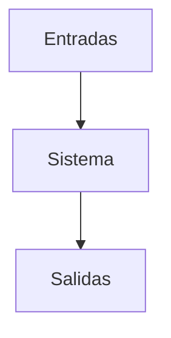

# ¿Qué es un sistema?

Grupo de unidades independientes que al interactuar forman algo unificado. 

Los sistemas pueden ser abiertos o cerrados

# Tarea

- Capitulo 1 y 3 (opcional)

- Waters foundation: hábitos de un pensador sistémico
